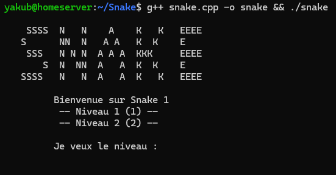
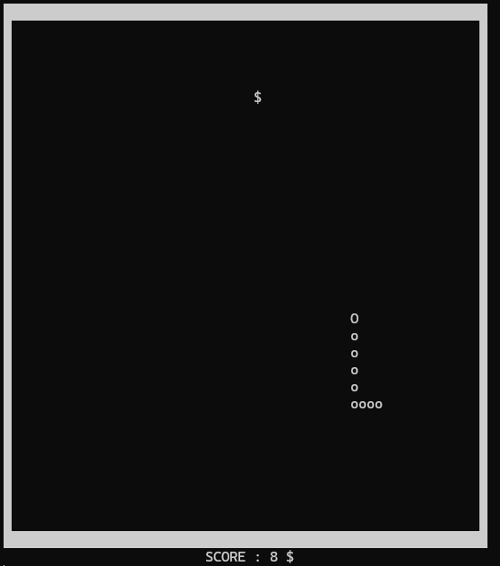
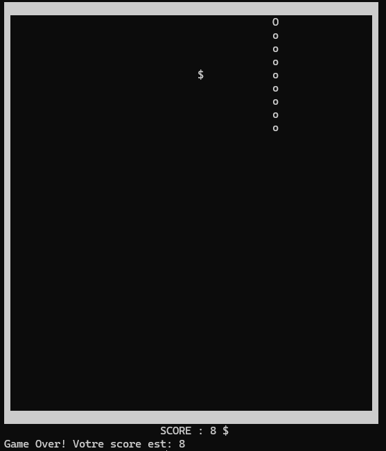

# Snake

Ce projet est une implémentation simple du célèbre jeu Snake, entièrement développée en C++ et jouable dans un terminal Linux. Il utilise les bibliothèques standard C++ avec des fonctionnalités basiques de contrôle du clavier et d'affichage en console.

## Fonctionnement du jeu

### Lancement :

Pour compiler et exécuter le jeu, utilisez la commande suivante dans le terminal :

```sh
g++ snake.cpp -o snake && ./snake
```

### Menu principal :

À l’exécution, un menu s'affiche avec un logo "SNAKE" suivi d'un choix de niveau :
Le joueur peut choisir entre deux niveaux de difficulté (1 ou 2).



## Interface du jeu

Une fois le jeu lancé :

- Le serpent est représenté par la lettre o.

- La nourriture est représentée par le caractère $.

- Le score est affiché en bas de l’écran.

- Le jeu se termine quand le serpent touche un mur ou lui-même.



## Fin du jeu

Lorsque le joueur perd, le message suivant s’affiche :

```
Game Over! Votre score est: 8
```

